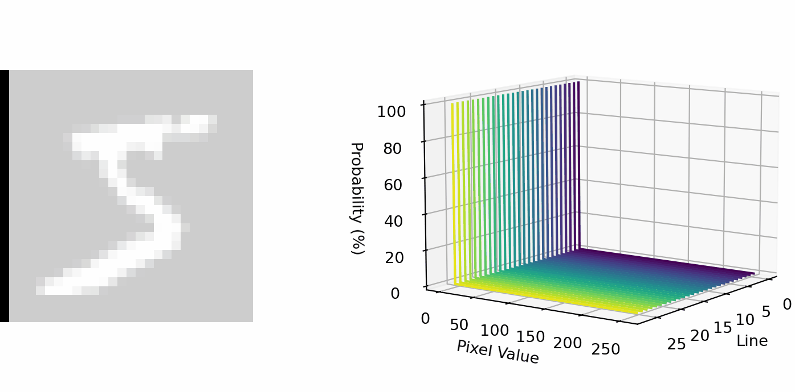

These files are related to tasks outside the training and evaluating of GANs, they were used to produce most of the figures in the final document and to create the reduced Flower and CelebA datasets.

The function of each file is described shortly here.

+ **datasets** This file is used to plot the samples from the datasets.
+ **datasets_preprocess** Contains code to create the reduced datasets of Flowers and CelebA.
+ **plots** Miscellaneous plots shown in the document.
+ **results** Contains the code that produced the charts of the metrics for all tests.
+ **mnist_distribution** Produces the various visualizations of the MNIST dataset distribution, including the one bellow.

